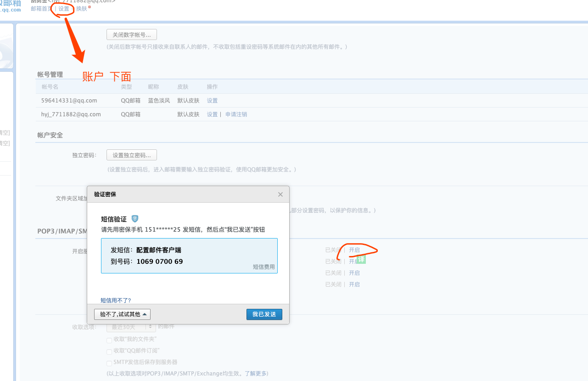
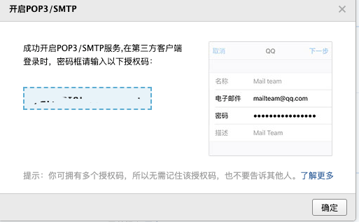
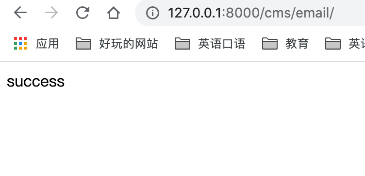

[TOC]
https://pythonhosted.org/Flask-Mail/
config.py里面
```
MAIL_PASSWORD

```
上面这个密码的确定:




运行程序:测试成功


可以google查qq邮箱发送服务器地址
https://service.mail.qq.com/cgi-bin/help?subtype=1&id=20010&no=1000557
可以查找端口
```
##可以google查qq邮箱发送服务器地址
MAIL_SERVER = "smtp.qq.com"
MAIL_PORT = 587
MAIL_USE_TLS = True
# MAIL_USE_SSL : default False
# MAIL_DEBUG : default app.debug
MAIL_USERNAME ="xxxxxx@qq.com"
MAIL_PASSWORD ="xxxxxxxxxxxxx"
MAIL_DEFAULT_SENDER = "xxxxx@qq.com"

# MAIL_USE_TLS：端口号587
# MAIL_USE_SSL：端口号465
# QQ邮箱不支持非加密方式发送邮件
# 发送者邮箱的服务器地址


```


其他邮箱类似的设置

